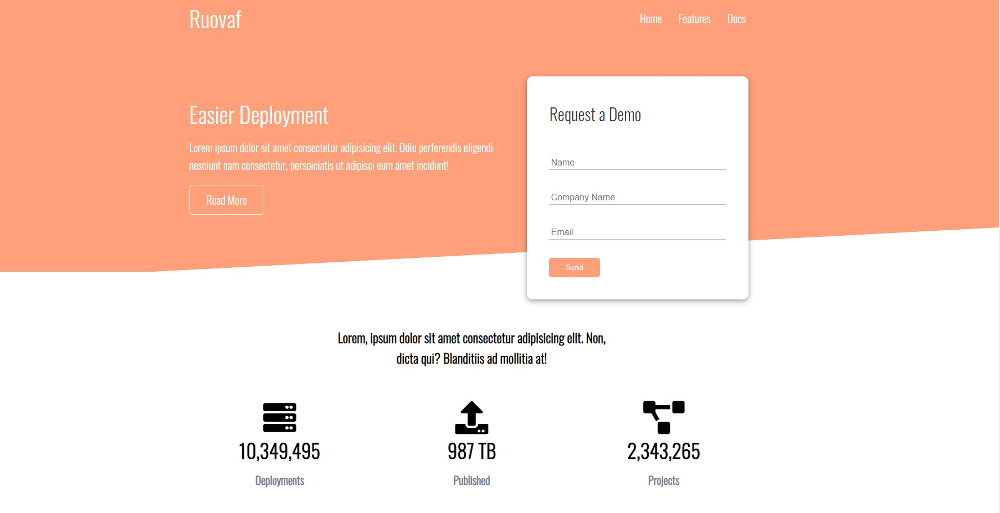

# Ruovaf Website
Test project for a Cloud hosting website.



## Built With
- [HTML5](https://developer.mozilla.org/en-US/docs/Web/Guide/HTML/HTML5)
- [CSS3](https://developer.mozilla.org/en-US/docs/Web/CSS)

## Install
```
    $ git clone git@github.com:samiiexx/ruovaf-website.git main
    $ cd main
```  
## Contributors
- Favour Samuel (@samiiexx)

## License
Copyright (c) 2021 Favour Samuel.

For enquiries please contact me at [favour@starboxtech.com](mailto:favour@starboxtech.com).